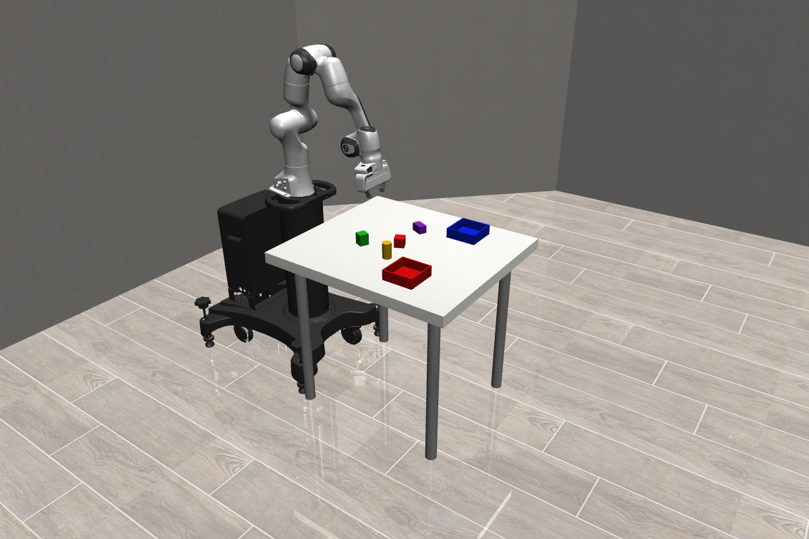
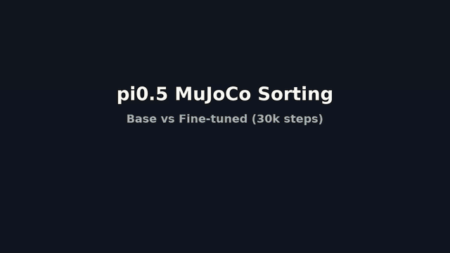
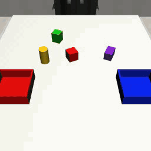

# π0.5 MuJoCo Sorting：仿真、数据与微调评测

本项目用 robosuite/MuJoCo 搭建 Panda 机械臂抓取放置场景，采集专家轨迹，与 MimicGen 合并成 LeRobot v3.0 数据集，微调 π0.5，再用相同种子比较 Base 与 FT。以下命令按实际流程排列，均从仓库根目录执行。权重、完整数据和大型日志不随 Git 分发。

## 1. 仿真搭建



这张图是本项目场景的真实 MuJoCo 渲染，不是示意图。桌子居中，旁边是配备双指夹爪的 Franka Emika Panda 七轴机械臂；桌面上有红/绿方块、黄色圆柱体、紫色小盒子和红/蓝两个目标箱。四种物体 × 两个箱子构成八种任务。

仓库**已包含仿真源代码**，但场景不是单个静态 MJCF 文件：[`sorting_env.py`](custom_sorting/sorting_env.py)在运行时组合 `TableArena`、Panda 和物体，生成 MuJoCo 模型；[`objects.py`](custom_sorting/objects.py)定义物体；[`sorting.yaml`](configs/sorting.yaml)配置桌子、相机、随机生成范围和动作缩放；[`expert.py`](custom_sorting/expert.py)实现采集用规则专家。

仿真控制频率 20 Hz、每回合最多 300 步。动作是 `OSC_POSE` 7D：归一化末端平移 3D + 旋转增量 3D + 夹爪 1D（`-1` 张开，`+1` 闭合）。正面/腕部相机各输出 256×256 RGB。原始状态是末端位置 3D + `xyzw` 四元数 4D + 两个夹爪关节 2D，共 9D。指定物体进入指定箱子并释放才算成功。

实验服务器为 Linux、4 × RTX 4090；仿真使用 Python 3.11，策略训练/推理使用 Python 3.12。**MuJoCo 在服务器上以 EGL 无头模式运行**：不打开桌面窗口，直接离屏渲染相机图像和评测视频。NVIDIA 驱动、EGL/OpenGL 等系统依赖因机器而异，请根据 [MuJoCo 官方可视化文档](https://mujoco.readthedocs.io/en/stable/programming/visualization.html#using-opengl)自行配置并验证；本仓库只给出已用过的环境变量和烟测命令，不代替系统级驱动安装。上游版本与 Python 依赖见[环境说明](docs/environment.md)。

```bash
git clone https://github.com/helpsds/pi.git
cd pi
git clone https://github.com/huggingface/lerobot.git
git -C lerobot checkout 4aaff99be4a1d81568c08c8f0296b41b40c99ec4
mkdir -p third_party
git clone https://github.com/ARISE-Initiative/robosuite.git third_party/robosuite
git -C third_party/robosuite checkout 5ce6643f3092639d08f7b0f90ed1c6a84f50552c
git clone https://github.com/robocasa/robocasa.git third_party/robocasa
git -C third_party/robocasa checkout a07e365c958c4216cd6bbd5f30b47f09a65c6f00
```

```bash
# 仿真环境：需预先安装适配 GPU 的 NVIDIA 驱动
conda create -n robocasa python=3.11 -y
conda activate robocasa
python -m pip install -e third_party/robosuite
python -m pip install -e third_party/robocasa
python -m pip install mujoco==3.8.1 opencv-python pyyaml

# 另建策略环境：需预先安装 Python 3.12 和适配 CUDA 的 PyTorch
conda deactivate
python3.12 -m venv .venv
source .venv/bin/activate
python -m pip install --upgrade pip
python -m pip install -e './lerobot[training,pi]'
python -m pip install numpy scipy opencv-python matplotlib pyyaml pyarrow
```

下载 π0.5 Base 权重及 PaliGemma tokenizer 到本地，按许可在 Hugging Face 完成认证；后文用 `BASE_MODEL`、`PI05_TOKENIZER_PATH` 指向目录，不在仓库保存 token。实验使用 `torch==2.7.1+cu128`，具体 CUDA 安装命令取决于机器。

用 EGL 重新导出上图，兼做场景烟测：

```bash
conda activate robocasa
CUDA_VISIBLE_DEVICES=0,1,2,3 MUJOCO_GL=egl PYOPENGL_PLATFORM=egl \
MUJOCO_EGL_DEVICE_ID=0 PYTHONPATH=$PWD/third_party/robosuite:$PWD \
python scripts/export_sorting_overview.py --output assets/figures/sorting_scene.png
```

此命令只导出静态图，不打开交互窗口。无 NVIDIA EGL 的 Linux 可用 `MUJOCO_GL=glx LIBGL_ALWAYS_SOFTWARE=1 xvfb-run -a python ...` 软件渲染。EGL 故障见[常见问题](docs/troubleshooting.md)。

## 2. 数据采集

[规则专家](custom_sorting/expert.py)按“接近 → 抓取 → 抬起 → 移动 → 释放”采集八种任务各十条**成功**轨迹，共 80 条；失败尝试不保存。原始数据为压缩 NPZ 与 `manifest.json`，含两路图像、9D 状态、7D 动作和成功标志。输出目录必须事先不存在。

```bash
conda activate robocasa
CUDA_VISIBLE_DEVICES=0,1,2,3 MUJOCO_GL=egl PYOPENGL_PLATFORM=egl \
MUJOCO_EGL_DEVICE_ID=0 PYTHONPATH=$PWD/third_party/robosuite:$PWD \
python scripts/collect_sorting_demos.py \
  --config configs/sorting.yaml --episodes 80 --max-attempts 200 \
  --max-steps 300 --output outputs/sorting_raw_8tasks_x10
```

检查 `outputs/sorting_raw_8tasks_x10/manifest.json` 应有 80 条记录。快速烟测可改用**另一个输出目录**及 `--episodes 1 --max-attempts 2`。

## 3. 数据处理

先下载 [MimicGen 12 tasks v2.1](https://huggingface.co/datasets/yananchen/mimicgen_source_12tasks_v21)。LeRobot 转换脚本会**原地修改**指定目录，所以保留原始备份，仅转换工作副本：

```bash
source .venv/bin/activate
mkdir -p data/external
hf download yananchen/mimicgen_source_12tasks_v21 --repo-type dataset \
  --local-dir data/external/mimicgen_source_12tasks_v21
cp -a data/external/mimicgen_source_12tasks_v21 \
  data/external/mimicgen_source_12tasks_v30_work
python lerobot/src/lerobot/scripts/convert_dataset_v21_to_v30.py \
  --repo-id yananchen/mimicgen_source_12tasks_v21 \
  --root "$PWD/data/external/mimicgen_source_12tasks_v30_work" \
  --push-to-hub=false
```

合并脚本读取 80 条 Sorting 和 120 条 MimicGen，生成 200 条轨迹、18 个任务标签的 LeRobot v3.0 数据集。Sorting 的 `xyzw` 四元数经 `Rotation.as_rotvec()` 转成 axis-angle 旋转向量，统一状态为 `[eef_xyz, rotvec_xyz, finger_1, finger_2]`（8D）；动作为 `[delta_xyz, delta_rotvec_xyz, gripper]`（7D），两路图像为 256×256。脚本校验形状并写 `conversion_manifest.json`；输出目录必须事先不存在。

```bash
source .venv/bin/activate
PYTHONPATH=$PWD/lerobot/src:$PWD \
python scripts/build_sorting_mimicgen_combined.py \
  --sorting-raw outputs/sorting_raw_8tasks_x10 \
  --mimicgen-root data/external/mimicgen_source_12tasks_v30_work \
  --output data/pi05_sorting_mimicgen_200eps \
  --repo-id local/pi05_sorting_mimicgen_200eps
python -m json.tool data/pi05_sorting_mimicgen_200eps/conversion_manifest.json
python -m json.tool data/pi05_sorting_mimicgen_200eps/meta/info.json
```

本次生成 200 条轨迹、52,118 帧。**时序限制**：Sorting 原始为 20 Hz，MimicGen 为 10 Hz；合并数据的 FPS 元数据为 10，但未对 Sorting 帧/动作做重采样。格式见[数据说明](docs/dataset.md)。

## 4. 微调

训练 π0.5 共 30,000 个 optimizer steps。四卡、每卡 microbatch 1、梯度累积 16，有效 batch 64；action expert 和视觉编码器参与训练，EMA 关闭，每 10k 步保存检查点。脚本固定四卡；改变卡数需同步修改 `--nproc-per-node` 和批次配置。训练输出目录必须不存在。

```bash
source .venv/bin/activate
export BASE_MODEL=/absolute/path/to/pi05_base
export PI05_TOKENIZER_PATH=/absolute/path/to/paligemma_tokenizer_snapshot
export DATASET_ROOT="$PWD/data/pi05_sorting_mimicgen_200eps"
export CUDA_DEVICES=0,1,2,3
nohup bash scripts/train_pi05_30k.sh > outputs/pi05_sorting_30k.log 2>&1 < /dev/null &
echo "training PID: $!"
tail -f outputs/pi05_sorting_30k.log
```

检查点位于 `outputs/pi05_sorting_30k/checkpoints/`。`nohup` 仅防止终端断开，不等于自动断点续训；不能直接重跑覆盖现有输出。实验中的 10k 断点恢复及超参数见[实验记录](docs/experiments.md)。

## 5. 测评

正式评测为八任务 × 十个环境 seed（`12000..12009`）× 两策略。Base 与 FT 使用**相同环境 seed 和 policy seed**；每回合上限 300 步，`n_action_steps=10`。脚本使用模型 GPU 0/1、EGL GPU 2/3，按四卡机器编写。评测需使用合并数据集的统计量做动作反归一化。

```bash
source .venv/bin/activate
export BASE_MODEL=/absolute/path/to/pi05_base
export FT_MODEL="$PWD/outputs/pi05_sorting_30k/checkpoints/030000/pretrained_model"
export PI05_TOKENIZER_PATH=/absolute/path/to/paligemma_tokenizer_snapshot
export DATASET_ROOT="$PWD/data/pi05_sorting_mimicgen_200eps"
export SIM_CONDA_ENV=robocasa
bash scripts/eval_base_vs_ft_10seeds.sh
python -m json.tool outputs/pi05_sorting_base_vs_ft_10seeds/summary.json
```

每回合日志和视频在 `outputs/pi05_sorting_base_vs_ft_10seeds/`；公开轻量结果见 [`results/`](results/README.md)。各 checkpoint 与 `n_action_steps=1/10` 的探索性评测见[实验记录](docs/experiments.md)。

## 6. 结果展示

主结果是配对多 seed 测试，不应与单 seed/checkpoint 探索性结果混用：

| 策略 | 任务成功 | 抓取成功 | 回合数 |
|---|---:|---:|---:|
| π0.5 Base | 0/80（0%） | 0/80（0%） | 80 |
| π0.5 FT，30k steps | **43/80（53.75%）** | **54/80（67.50%）** | 80 |


Base 与 FT 的完整 52 秒配对演示（已压缩为可在 README 中直接播放的动图）：



单回合成功与失败示例：

| Base：红方块→蓝箱失败 | FT：红方块→蓝箱成功 |
|---|---|
|  |  |

| FT：绿方块→蓝箱成功 | FT：圆柱体抓起但放置失败 |
|---|---|
|  |  |

动图由仓库内 MP4 素材生成，可用 `bash scripts/make_demo_gifs.sh` 重建；无需下载视频即可在 GitHub README 中观看。逐任务统计、典型失败分析及指标定义见[实验记录](docs/experiments.md)和[结果文件](results/README.md)。

保留训练日志时可重画损失曲线（原实验在 10k 恢复）：

```bash
source .venv/bin/activate
python scripts/plot_training_loss.py \
  --initial-log outputs/pi05_sorting_30k.log \
  --resume-log outputs/pi05_sorting_30k_resume.log \
  --resume-step 10000 \
  --output assets/figures/training_loss.png \
  --csv results/training_loss.csv
```

这里的 Base 在 Sorting 上为 0%，不代表它在 LIBERO 等其他基准上的表现；结果仅覆盖仿真中的八种物体/箱子组合，不代表真实机器人迁移。请遵守 [LeRobot](https://github.com/huggingface/lerobot)、[robosuite](https://github.com/ARISE-Initiative/robosuite) 及模型/数据发布者的许可。
