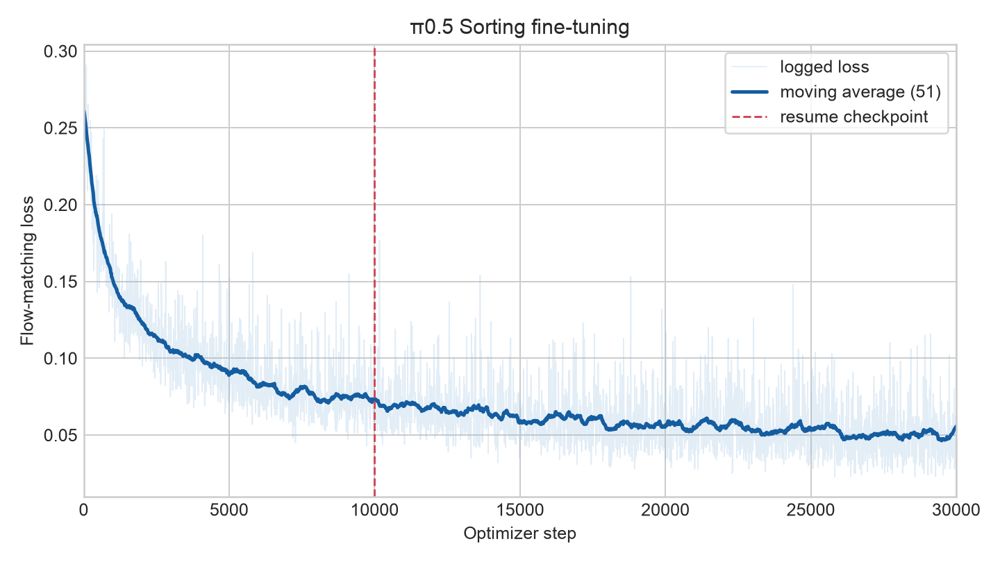
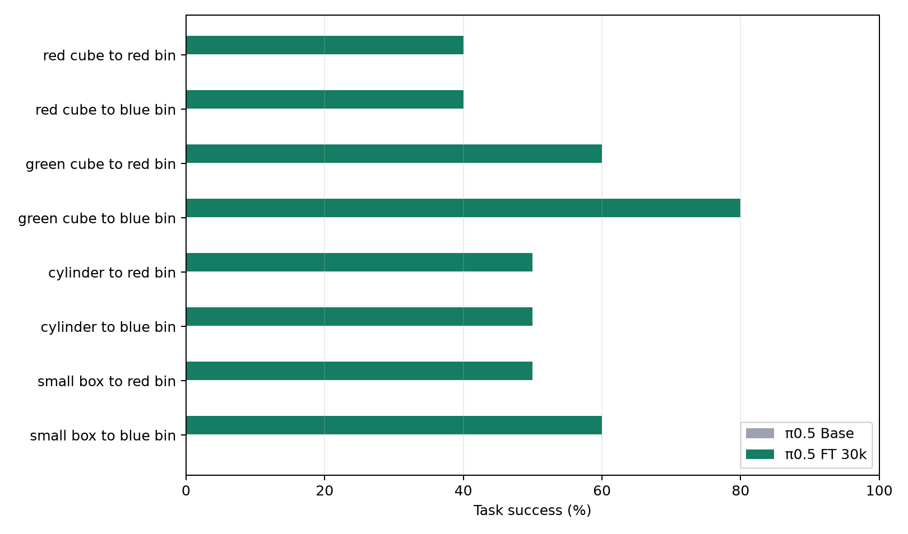

# π0.5 Sorting in MuJoCo

An end-to-end robot-learning project covering MuJoCo/EGL simulation, scripted expert collection, LeRobot v3.0 dataset construction, π0.5 fine-tuning, action-space diagnostics, and deterministic multi-seed evaluation.

The main result is a **0% → 53.75%** task-success improvement over π0.5 Base on eight unseen-layout sorting tasks (80 episodes per model, paired seeds, `n_action_steps=10`).

| Policy | Task success | Grasp success | Episodes |
|---|---:|---:|---:|
| π0.5 Base | 0.00% | 0.00% | 80 |
| π0.5 FT, 30k steps | **53.75%** | **67.50%** | 80 |





## Qualitative results

**[Watch the 52-second Base vs FT demo](assets/videos/pi05_base_vs_ft_demo.mp4)**

| Base failure | Fine-tuned success |
|---|---|
| [red cube → blue bin](assets/videos/base_red_cube_blue_bin_failure.mp4) | [red cube → blue bin](assets/videos/ft_red_cube_blue_bin_success.mp4) |

Additional examples:

- [FT success: green cube → blue bin](assets/videos/ft_green_cube_blue_bin_success.mp4)
- [FT failure: cylinder grasped, placement failed](assets/videos/ft_cylinder_place_failure.mp4)

GitHub may show MP4 files as links instead of inline players. Downloading the files preserves the complete rollout.

## What is included

```text
configs/          Sorting task and controller configuration
custom_sorting/   MuJoCo/robosuite environment, objects and scripted expert
scripts/          Collection, conversion, training, evaluation and plotting
results/          Lightweight JSON/CSV evaluation artifacts
assets/           Selected videos and figures
docs/             Environment, dataset, experiment and troubleshooting notes
```

Model weights, datasets, caches, raw logs and third-party repositories are intentionally excluded.

## Reproduce

1. Follow [Environment setup](docs/environment.md).
2. Collect and build the dataset using [Dataset pipeline](docs/dataset.md).
3. Fine-tune π0.5:

   ```bash
   CUDA_DEVICES=0,1,2,3 \
   BASE_MODEL=/path/to/pi05_base \
   DATASET_ROOT=$PWD/data/pi05_sorting_mimicgen_200eps \
   bash scripts/train_pi05_30k.sh
   ```

4. Run the paired Base/FT evaluation:

   ```bash
   BASE_MODEL=/path/to/pi05_base \
   FT_MODEL=$PWD/outputs/pi05_sorting_30k/checkpoints/030000/pretrained_model \
   bash scripts/eval_base_vs_ft_10seeds.sh
   ```

5. Regenerate the loss curve from training logs:

   ```bash
   python scripts/plot_training_loss.py \
     --initial-log outputs/pi05_sorting_30k.log \
     --resume-log outputs/pi05_sorting_30k_resume.log \
     --resume-step 10000 \
     --output assets/figures/training_loss.png \
     --csv results/training_loss.csv
   ```

See [Experiments and failure analysis](docs/experiments.md) for the protocol and interpretation.

## Key implementation details

- Observation state: EEF `xyz` + axis-angle `rx, ry, rz` + two gripper joints = 8D.
- Action: normalized delta EEF translation/rotation + gripper command = 7D.
- Cameras: front and wrist, 256×256 RGB.
- State/action normalization: quantile; images: identity.
- Visual encoder and action expert are trainable; EMA is disabled.
- Effective batch size: `1 × 16 accumulation × 4 GPUs = 64`.
- Evaluation uses paired environment and policy seeds.

## Limitations

- The 200-episode training mixture contains Sorting and MimicGen domains with different source control rates; frames were not temporally resampled.
- Base receives target-dataset normalization statistics so that its normalized actions can be mapped into this environment's action convention. This is an adaptation layer, not learned task behavior.
- The benchmark is simulation-only and currently covers eight sorting task variants.
- The official multi-seed result uses only `n_action_steps=10`; the checkpoint ablation also reports `n_action_steps=1`.

## Upstream projects

- [LeRobot](https://github.com/huggingface/lerobot)
- [robosuite](https://github.com/ARISE-Initiative/robosuite)
- [RoboCasa](https://github.com/robocasa/robocasa)
- [MimicGen dataset](https://huggingface.co/datasets/yananchen/mimicgen_source_12tasks_v21)

This repository contains integration and experiment code only. Respect the licenses and access terms of all upstream models and datasets.
